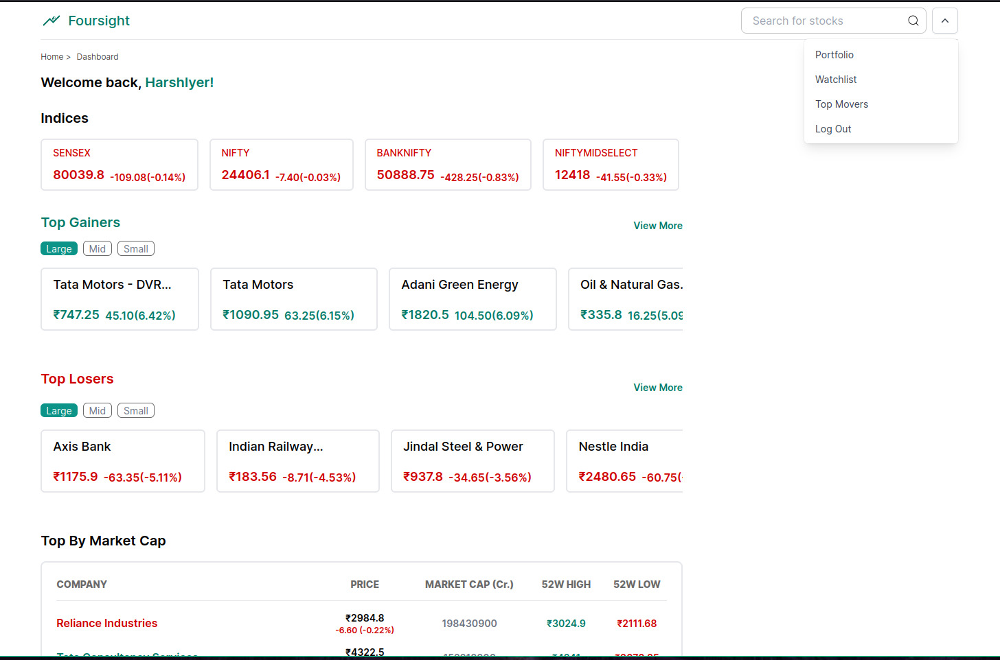
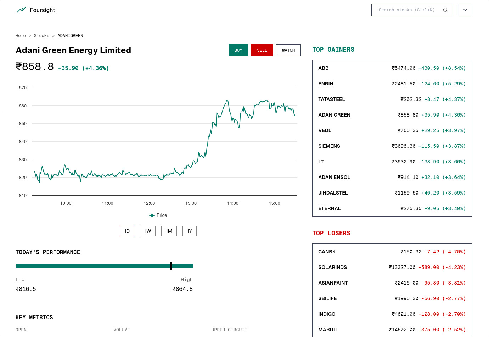
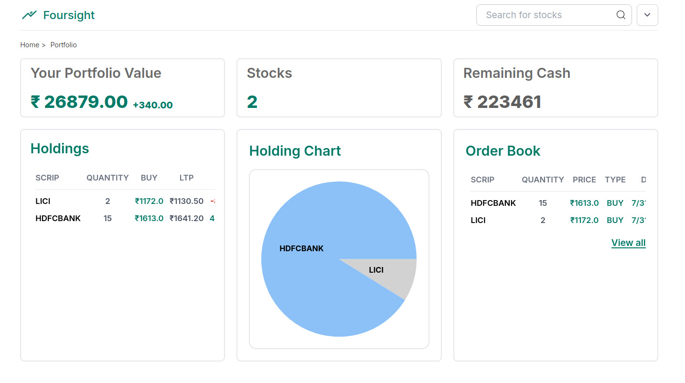
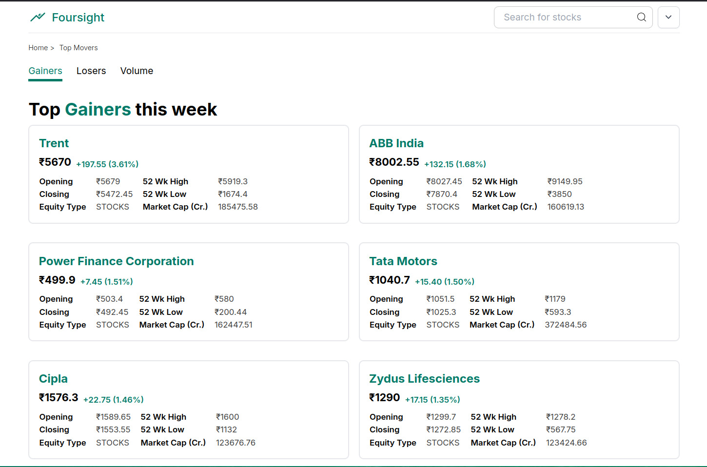
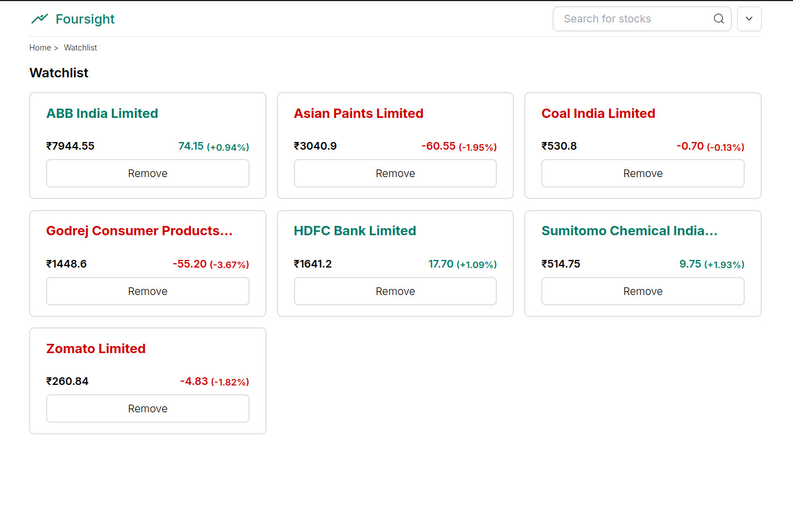

## TradeKaro

### Trading & Stock Analysis for the Indian Stock Market

TradeKaro is a web application for Indian stock market participants: live quotes for
3,000+ NSE scrips, option chains across the major indices, interactive charts, and a
full order-management workflow — order tickets, positions, P&L, watchlists and a
tradebook.

> **Demo environment.** Market data is live, but no orders are placed with any
> exchange or broker and no real funds are held or moved. Balances and deposits are
> simulated credits for evaluation only. See the in-app Terms & risk disclosure.



### Key Features

- **Live data** — real-time quotes for a large selection of Indian stocks, driven by a
  single multiplexed websocket feed.
  
- **Trading** — buy and sell against live market prices, with delivery (CNC) and
  intraday (MIS) legs tracked separately.
- **Options** — expiry selection, full option chain, and a single-leg order ticket with
  deep links straight to a contract.
  
- **Charting** — historical and intraday candles in interactive charts.
  
- **Portfolio management** — positions, mark-to-market P&L, closed round-trips,
  tradebook and funds.
- **Unified search** — one box that finds stocks, option chains and individual
  contracts.
- **Watchlists** — track your favourite stocks. 
- **Risk controls** — market-hours gate, intraday auto square-off at the cutoff,
  position and quantity caps, and an admin kill switch.

### Benefits

- **Structured practice** — trade against real prices without committing capital.
- **Market research** — analyse historical data, identify trends and screen movers.
- **Track your progress** — monitor performance and refine your approach over time.

### Tech stack

- **Framework** — Next.js 16 (App Router, React 19, TypeScript), styled with Tailwind.
  The API lives in Next.js route handlers; there is no separate backend service.
- **Database** — SQLite via Node's built-in `node:sqlite` (`DatabaseSync`), in WAL mode,
  at `data/trade.db`. No external database server and no ORM.
- **Market data** — Upstox REST (quotes, candles, option chains) plus the
  `upstox-js-sdk` websocket behind a single shared connection.
- **Runtime** — a long-lived Node server. Node **24+ is required** (`node:sqlite`
  without a flag).

### Running locally

```bash
npm ci
cp .env.example .env.local     # fill in the Upstox token
npm run dev                    # http://localhost:3000
```

The first boot seeds a superadmin from `ADMIN_EMAIL` / `ADMIN_PASSWORD`. If you leave
`ADMIN_PASSWORD` blank a random one is generated and printed once to the server log —
the safer choice, since these values also end up in shell history.

### Health check

```bash
node scripts/smoke.mjs         # end-to-end checks against a running server
```

### Deploying

This app needs a **persistent filesystem and a long-lived process**, which rules out
serverless platforms:

- **Won't work:** Vercel, Netlify Functions, Cloudflare Pages/Workers. Their filesystems
  are ephemeral, so `data/trade.db` is wiped on every deploy, and the websocket feed plus
  the square-off timer need a process that stays alive.
- **Works:** a Linux VPS, or a container host with a disk — Render (with a disk), Railway
  or Fly.io (with a volume).

**Linux VPS (Ubuntu/Debian) — recommended.** Node 24 + systemd + nginx. Full runbook and
troubleshooting table in [`deploy/README.md`](deploy/README.md):

```bash
git clone https://github.com/h0i5/Foursight.git /tmp/tk
sudo bash /tmp/tk/deploy/setup-vps.sh yourdomain.com
# fill in /opt/tradekaro/.env.production, then:
sudo bash /opt/tradekaro/deploy/deploy.sh
```

**Docker**, if you prefer a container:

```bash
docker build -t tradekaro --build-arg NEXT_PUBLIC_SITE_URL=https://your-domain .
docker run -d --name tradekaro -p 3000:3000 \
  --env-file .env.production \
  -v tradekaro-data:/app/data \
  tradekaro
```

`-v tradekaro-data:/app/data` is not optional: without it every redeploy starts from an
empty database and every user account is lost. Back up `data/` on a schedule —
`scripts/backup.mjs` writes timestamped copies.

`NEXT_PUBLIC_*` values are inlined at **build** time, so `NEXT_PUBLIC_SITE_URL` must be set
before building, not only at runtime.

### Security notes

- `.env*`, `data/` and `*.db` are gitignored. Keep it that way — the SQLite file holds
  account records and admin password hashes, and the backups under `data/backups/` are
  full copies of it.
- Set a strong `ADMIN_PASSWORD` and a fresh `AUTH_SECRET` per environment in production;
  do not ship the development values.
- Upstox tokens expire. The server keeps running without a valid token, but quotes and
  the feed will report as unavailable.

### License

See [LICENSE](LICENSE).
