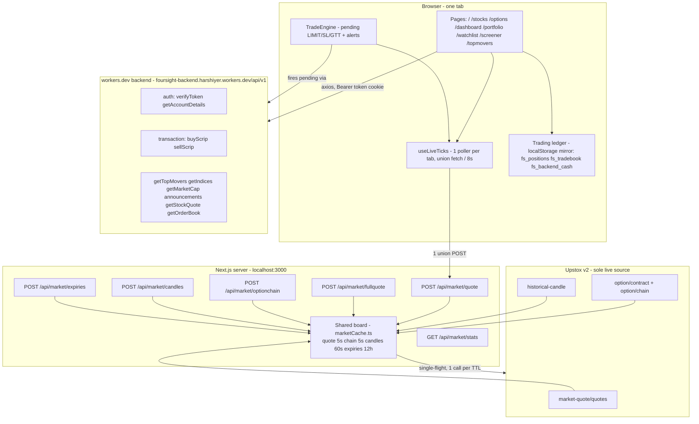

# TradeKaro — how the whole website works

Market analysis + trading for NSE/BSE. Live prices from Upstox, accounts and
aux data from the workers.dev backend, orders settled on the server.



## 1. Page shell (every route pays this)

`app/layout.tsx` mounts on all pages: `Navbar`, `TickerTape` (9 live
symbols), `TradeEngine`, `StatusBar` (clock + NIFTY live), `MobileBottomNav`,
`CommandPalette`, `Footer`, `Toaster`, `Analytics`. `middleware.ts` guards
`/dashboard /login / /portfolio`: no cookie = instant redirect, no verify
round-trip; with cookie = one `POST /auth/verifyToken`.

## 2. Live data path (Upstox only)

- Keys: `app/lib/upstox.ts` — `UPSTOX_MAP` ISINs for equities, index names
  for NIFTY/BANKNIFTY/FINNIFTY/SENSEX, `upstoxKey()` fallback.
- Token: `UPSTOX_ANALYTICS_TOKEN` in `.env.local`, `hasUpstox()` gate.
- Client: `app/hooks/useLiveTicks.ts` — refcounted `wanted` set, one
  `fetchUnion()` per tab every 8s (paused when tab hidden), chunks of 10.
- Server: `app/lib/marketCache.ts` `cached(key, ttl, fetcher)` — fresh hit
  wins, concurrent misses share one `inflight` promise, stats in `cacheStats`.
- Routes: `quote` + `fullquote` + `optionchain` 5s, `candles` 60s,
  `expiries` 12h, `stats` exposes hits vs upstoxCalls.
- Result: 100 users in one 5s window = 1 Upstox batch. No users = 0 calls.
  Memory-only board, restart wipes it, first user re-primes.

## 3. Trading engine (server-authoritative)

The server owns the ledger (`app/lib/tradingServer.ts`); `app/lib/trading.ts` is an
optimistic UI mirror plus the client-side pre-checks that give instant feedback.
Editing localStorage changes nothing that counts.

- **Only writer:** `POST /api/trade/order`. Every fill is validated against a
  real market price (3% stock / 6% option tolerance), then checked against a
  book rebuilt from the server's own append-only log — so you cannot sell what
  you never bought or spend cash you do not have. Refusals are recorded in
  `trade_rejects` with a reason code.
- **Wallet** = seeded capital + deposits − fills − charges − margin used
  (`deriveAccount().cash`). The navbar pill, dashboard tile and portfolio wallet
  all read this through `accountSnapshot()` in `app/lib/accountData.ts`, so they
  cannot disagree.
- **Realised P&L** is banked per scrip the moment it returns to FLAT, so a scrip
  closed and later reopened keeps the round-trip it already completed.
- `executePaperFill()` mirrors the server's avg-cost logic locally for instant
  feedback; `getRealizedPnl()` is the offline fallback only.
- UI: `OrderTicket` / `BuyPopup` / `SellPopup` / `BasketPanel` /
  `DockedTicket` write fills; `PositionsPanel`, `Networth`, `Tradebook`,
  `Funds`, `PortfolioStrip`, `WatchlistPositionsPreview` read them.
- `TradeEngine` polls pending + alerts against board LTP and fires
  `buyScrip/sellScrip` when logged in. Order placement never blocks on a quote.

## 3a. Deposits and the KYC gate (server-authoritative)

`trade_deposits` is the append-only funding ledger. Two writers, both
server-side — `POST /api/trade/deposit` (the user, from the Funds panel) and
`POST /api/admin/clients` with `deposit` (an operator, from Users & KYC →
OPEN). `idem` makes a double-submitted form a no-op instead of a double credit,
and each amount is capped (₹5,00,000 per deposit, ₹10,00,000 lifetime).

A deposit does two things at once:

1. **It is trading capital.** Money = `trade_accounts.start_cash +
SUM(trade_deposits.amount)`, so funding ₹25,000 buys ₹25,000 of trading room.
   The seeded `start_cash` is deliberately NOT counted as a deposit — every
   account gets it on first use, so counting it would make the gate meaningless.
2. **It gates KYC.** `settings.kyc.minDeposit` (0 = off) is the requirement.
   `kycGate()` in `app/lib/kycGate.ts` derives `eligible`/`remaining`/`progress`,
   and `publicAccount()` returns `deposited`, `kycMinDeposit`, `kycEligible` and
   `kycRemaining` alongside the account — computed on the server, because a
   browser that could decide it is eligible is not a gate at all.

The KYC page shows the progress (“₹500 deposited · ₹24,500 left”) and, until the
goal is met, does not render the application form at all — only the requirement
and a way to fund. The threshold is edited in Settings → Trading & Risk → KYC
eligibility (presets ₹10k/₹20k/₹25k/₹50k, or an exact amount) and published
through `GET /api/admin/public`.

## 3b. Connect account (`/connect`)

Pairs the user's **User ID** with a **connection token** for linking the account
to an external trader. `GET/POST /api/account/connect` decides everything:

- `POST` refuses with `code: "kyc_required"` until KYC is `VERIFIED`, and
  refuses outright on a frozen account. The token is never sent early.
- On success it returns a 15-character code (`ABCDE-FGHJK-MNPQR`) minted by
  `app/lib/connectToken.ts` and stored in `kv`, so it is stable across reveals.
  The alphabet omits I/O/0/1, which get misread when copied by hand.

`standingForUser()` in `app/lib/directory.ts` resolves the KYC verdict through
the same merge the Users & KYC list uses. Resolving by email instead is wrong:
one account commonly has several registry rows (one per heartbeat identity), so
a bare email match can land on a stale row and disagree with the admin panel.

**KYC is an operator-owned field.** `heartbeat()` will not overwrite a verdict
`mutateClient()` recorded (`ClientRecord.kycBy === "operator"`). The browser's
own claim comes from a legacy stub that always answers `PENDING`, and letting it
win silently reverted an operator's `VERIFIED` on the user's next page load —
which relocked the token above.

## 4. Backend on workers.dev (non-Upstox data)

Base `app/components/apiURL.tsx`. Auth cookie `token` via `cookies-next`.

| Area           | Endpoint                                                    | Used by                                                  |
| -------------- | ----------------------------------------------------------- | -------------------------------------------------------- |
| Auth           | `POST /auth/verifyToken`, `POST /auth/getAccountDetails`    | middleware, Navbar funds pill, PortfolioStrip            |
| Trade mirror   | `POST /transaction/buyScrip`, `POST /transaction/sellScrip` | OrderTicket, popups, basket, TradeEngine, PositionsPanel |
| Movers         | `POST /getTopMovers`, `POST /topmovers`                     | dashboard, /topmovers, landing LiveMovers                |
| Indices/market | `POST /getIndices`, `POST /getMarketCap`                    | dashboard IndicesSection, MarketStatusRow                |
| News           | `POST /announcements` → `{articles}`                        | NewsFeed, StockNews                                      |
| Quote/depth    | `POST /getStockQuote`, `POST /getOrderBook`                 | stock page header, `useOrderBook` DepthPanel/Orderbook   |

## 5. Pages and what each fetches

- `/` landing: `LiveSpark` (candles), `LiveRelianceCard` + `LiveWatchlist`
  (quotes), `LiveMovers` (topmovers), `MarqueeTicker` (quotes).
- `/stocks`: explore + `WatchlistRail` (shared hook quotes).
- `/stocks/[symbol]`: `fullquote` + `candles` (HighChart) + `getStockQuote` +
  `getOrderBook` (5s) + `announcements` + OrderTicket/Basket.
- `/options`: `expiries` + `optionchain` + underlying quote, BUY/SELL pills
  write option fills with lotSize.
- `/dashboard`: `getIndices` + `getTopMovers` + `getMarketCap` +
  `announcements` + MarketStatusRow (quotes) + BreadthHero + PortfolioStrip.
- `/portfolio`, `/portfolio/orders`: backend cash + local ledger, Networth
  pie (recharts).
- `/watchlist`, `/screener`, `/topmovers`: watchlist CRUD (`watchlists.ts`),
  screener normalize, movers grid.
- `/login /signup /logout /auth/callback`: token cookie lifecycle.
- `/profile`: hub — Identity (display name `fs_display_name`, PAN-masked,
  KYC pill), Funds snapshot (backend cash + trading wallet + P&L), KYC preview
  - Banks preview, Quick actions grid.
- `/profile/kyc`: 6-step stub (`fs_kyc_draft`: PAN/DOB/address/income/
  nominee/signature), progress bar, SAVE DRAFT only — wire backend later.
- `/profile/banks`: device-only Banks (`fs_bank_accounts`) + UPI
  (`fs_upi_ids`), IFSC/UPI regex, primary logic.
- `/profile/security`, `/ledger`, `/settings`: password/sessions/token
  status, funds statement + CSV, theme/density/qty/confirm/clear trading data.

## 6. Perf rules (why it stays fast)

- Prod: `npm run build` + `npm run start`. `npm run dev` recompiles per
  route (bottom-right pill) and is never the speed reference.
- 1 client poller per tab, 8s, hidden-tab pause; clocks 30s not 1s.
- Server TTLs: hot 5s, candles 60s, expiries 12h; ≤10 symbols per batch.
- workers.dev calls only for auth/trade-mirror/aux, never blocking LTP.

## 7. Run it

```powershell
npm run build; npm run start
# http://localhost:3000
# health: GET /api/market/stats -> hits vs upstoxCalls
```

Token refresh is daily (Upstox expiry). Server restart clears the board.
For multi-instance prod, swap `marketCache.ts` Map for Redis; for 100+
live traders, add one Upstox WS v3 socket + SSE fan-out (see
`docs/market-scaling.md`).
