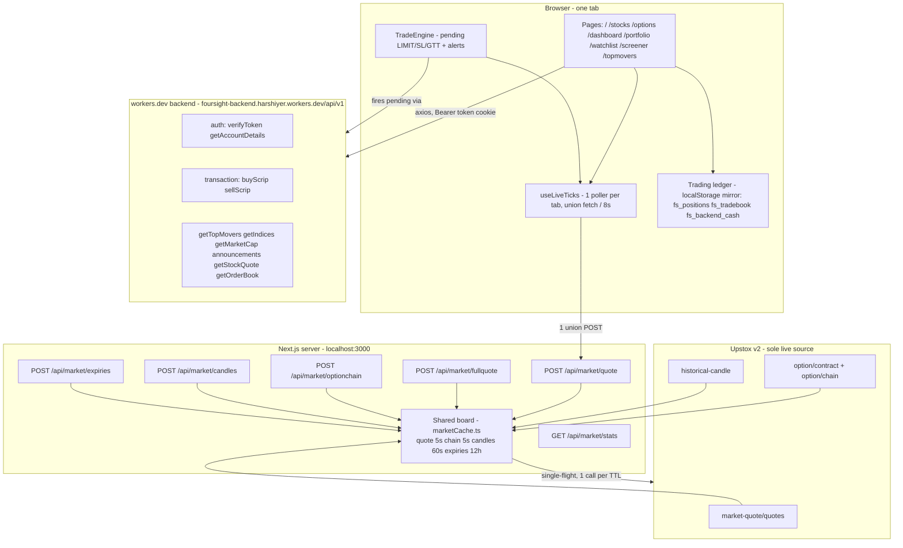

# TradeKaro — how the whole website works

Market analysis + trading for NSE/BSE. Live prices from Upstox, accounts and
aux data from the workers.dev backend, orders settled on the server.



## 1. Page shell (every route pays this)

`app/layout.tsx` mounts on all pages: `Navbar`, `TickerTape` (9 live
symbols), `TradeEngine`, `StatusBar` (clock + NIFTY live), `MobileBottomNav`,
`CommandPalette`, `Footer`, `Toaster`, `Analytics`. `middleware.ts` guards
`/dashboard /login / /portfolio`: no cookie = instant redirect, no verify
round-trip; with cookie = one `POST /auth/verifyToken`.

## 2. Live data path (Upstox only)

- Keys: `app/lib/upstox.ts` — `UPSTOX_MAP` ISINs for equities, index names
  for NIFTY/BANKNIFTY/FINNIFTY/SENSEX, `upstoxKey()` fallback.
- Token: `UPSTOX_ANALYTICS_TOKEN` in `.env.local`, `hasUpstox()` gate.
- Client: `app/hooks/useLiveTicks.ts` — refcounted `wanted` set, one
  `fetchUnion()` per tab every 8s (paused when tab hidden), chunks of 10.
- Server: `app/lib/marketCache.ts` `cached(key, ttl, fetcher)` — fresh hit
  wins, concurrent misses share one `inflight` promise, stats in `cacheStats`.
- Routes: `quote` + `fullquote` + `optionchain` 5s, `candles` 60s,
  `expiries` 12h, `stats` exposes hits vs upstoxCalls.
- Result: 100 users in one 5s window = 1 Upstox batch. No users = 0 calls.
  Memory-only board, restart wipes it, first user re-primes.

## 3. Trading engine (server-authoritative)

The server owns the ledger (`app/lib/tradingServer.ts`); `app/lib/trading.ts` is an
optimistic UI mirror plus the client-side pre-checks that give instant feedback.
Editing localStorage changes nothing that counts.

- **Only writer:** `POST /api/trade/order`. Every fill is validated against a
  real market price — 3% for a stock, 6% for an option, **10% for a commodity**
  (`TOLERANCE` in `tradingServer.ts`, selected by segment) — then checked against
  a book rebuilt from the server's own append-only log, so you cannot sell what
  you never bought or spend cash you do not have. Refusals are recorded in
  `trade_rejects` with a reason code.
- **Wallet** = seeded capital + deposits − fills − charges − margin used
  (`deriveAccount().cash`). The navbar pill, dashboard tile and portfolio wallet
  all read this through `accountSnapshot()` in `app/lib/accountData.ts`, so they
  cannot disagree.
- **Realised P&L** is banked per scrip the moment it returns to FLAT, so a scrip
  closed and later reopened keeps the round-trip it already completed.
- `executePaperFill()` mirrors the server's avg-cost logic locally for instant
  feedback; `getRealizedPnl()` is the offline fallback only.
- UI: `OrderTicket` / `BuyPopup` / `SellPopup` / `BasketPanel` /
  `DockedTicket` write fills; `PositionsPanel`, `Networth`, `Tradebook`,
  `Funds`, `PortfolioStrip`, `WatchlistPositionsPreview` read them.
- `TradeEngine` polls pending + alerts against board LTP and fires
  `buyScrip/sellScrip` when logged in. Order placement never blocks on a quote.

## 3a. Deposits and the KYC gate (server-authoritative)

`trade_deposits` is the append-only funding ledger. Two writers, both
server-side — `POST /api/trade/deposit` (the user, from the Funds panel) and
`POST /api/admin/clients` with `deposit` (an operator, from Users & KYC →
OPEN). `idem` makes a double-submitted form a no-op instead of a double credit,
and each amount is capped (₹5,00,000 per deposit, ₹10,00,000 lifetime).

A deposit does two things at once:

1. **It is trading capital.** Money = `trade_accounts.start_cash +
SUM(trade_deposits.amount)`, so funding ₹25,000 buys ₹25,000 of trading room.
   The seeded `start_cash` is deliberately NOT counted as a deposit — every
   account gets it on first use, so counting it would make the gate meaningless.
2. **It gates KYC.** `settings.kyc.minDeposit` (0 = off) is the requirement.
   `kycGate()` in `app/lib/kycGate.ts` derives `eligible`/`remaining`/`progress`,
   and `publicAccount()` returns `deposited`, `kycMinDeposit`, `kycEligible` and
   `kycRemaining` alongside the account — computed on the server, because a
   browser that could decide it is eligible is not a gate at all.

The KYC page shows the progress (“₹500 deposited · ₹24,500 left”) and, until the
goal is met, does not render the application form at all — only the requirement
and a way to fund. The threshold is edited in Settings → Trading & Risk → KYC
eligibility (presets ₹10k/₹20k/₹25k/₹50k, or an exact amount) and published
through `GET /api/admin/public`.

## 3b. Connect account (`/connect`)

Pairs the user's **User ID** with a **connection token** for linking the account
to an external trader. `GET/POST /api/account/connect` decides everything:

- `POST` refuses with `code: "kyc_required"` until KYC is `VERIFIED`, and
  refuses outright on a frozen account. The token is never sent early.
- On success it returns a 15-character code (`ABCDE-FGHJK-MNPQR`) minted by
  `app/lib/connectToken.ts` and stored in `kv`, so it is stable across reveals.
  The alphabet omits I/O/0/1, which get misread when copied by hand.

`standingForUser()` in `app/lib/directory.ts` resolves the KYC verdict through
the same merge the Users & KYC list uses. Resolving by email instead is wrong:
one account commonly has several registry rows (one per heartbeat identity), so
a bare email match can land on a stale row and disagree with the admin panel.

**KYC is an operator-owned field.** `heartbeat()` will not overwrite a verdict
`mutateClient()` recorded (`ClientRecord.kycBy === "operator"`). The browser's
own claim comes from a legacy stub that always answers `PENDING`, and letting it
win silently reverted an operator's `VERIFIED` on the user's next page load —
which relocked the token above.

## 3c. Sessions, segments and commodities

India's exchanges do not share a session, so "is the market open" is never one
question. `app/lib/marketClock.ts` holds the single answer.

| Segment     | Session (IST) | MIS square-off cutoff                 |
| ----------- | ------------- | ------------------------------------- |
| NSE cash    | 09:15–15:30   | 15:15 (admin `trading.squareOffTime`) |
| NFO         | 09:15–15:40   | 15:15                                 |
| MCX / NSCOM | 09:00–23:30   | 23:25 (session end − 5 min)           |

- `segmentPhase()` and `orderWindow()` take a segment. **Never call them without
  one on a path a commodity can reach** — the default is NSE, and an NSE answer
  for gold is wrong by eight hours in both directions.
- Sessions come from the provider's calendar (`app/lib/marketInfo.ts`), with a
  per-segment fallback used only when it is unreachable. An unreachable provider
  must never read as a market closure.
- `misCutoff()` is the ONE definition of a square-off cutoff: the order gate, the
  server sweep and the customer-facing countdown all call it. A notice promising
  15:15 while the sweep closes at 23:25 is worse than no notice.
- `broadMarketStatus()` backs the navbar/footer status pill, naming whichever
  market is actually open rather than reporting NSE alone.

**Commodities** resolve through the instrument master (`app/lib/instruments.ts`):

- The root comes from the **trading symbol** (`GOLD27FEBFUT` → `GOLD`), never the
  master's `name` column — `name` groups variants, labelling GOLD, GOLDM and
  GOLDPETAL all as "GOLD".
- `lot` means **quoted units per lot**. Quantity is in units end to end; only the
  ticket thinks in lots and multiplies before it posts.
- ⚠️ **The master's `lot_size` is not one unit, and is not even one kind of unit.**
  It is grams for GOLDM (100), kilograms for COPPER (2500) and **tonnes** for
  ZINC, LEAD and ALUMINIUM (5). The gold family is corrected by
  `QUOTED_UNITS_PER_LOT`; the tonne roots by `MASTER_LOT_IN_TONNES`. Read at face
  value, `5` priced a five-tonne zinc contract at about ₹2,156 — cheaper than a
  single gram of gold petal, and 1,600× under COPPER beside it. Bump
  `MASTER_VERSION` when changing either, or the week-long disk cache serves the
  old figure.
- The order gate's atom is the **unit**, not the lot. Fractional lots are allowed
  down to one unit (`trading.fractionalLots`, on by default) because a whole MCX
  gold lot needs roughly ₹7.65 lakh of margin. A fraction of a unit is refused.
- `MASTER_VERSION` gates the disk cache, which is trusted for a week. Bump it on
  any change to how the master is derived, or a deployed fix sits unused behind
  the old cache.
- ⚠️ **`tick` from the master is in PAISE.** Gold is 100 (₹1), zinc 5 (₹0.05),
  cotton 1000 (₹10) — gold is the tell, since a ₹100 tick on a ₹15,304 unit price
  is 0.65%, which no exchange quotes. `/api/market/instrument` divides by 100 at
  the boundary so every consumer gets rupees; `OrderTicket` and `AlertBox` both
  feed it straight into a ₹ price stepper, and served raw it made gold step ₹100
  at a time. Pinned by a smoke check — do not "fix" the division.
- ⚠️ `POST /api/market/quote` accepts **at most 10 symbols** and drops the rest
  SILENTLY. Chunk larger sets; `useLiveTicks` and `app/lib/movers.ts` already do.

### `/commodities`

The ladder is the discovery surface for the affordability problem above: MCX
lists several sizes per commodity, so a screen offering only "GOLD" is really
offering the 1 kg contract. `app/lib/commodityUnits.ts` holds the two things that
page needs and neither is derivable:

- **Family** — honest grouping of the size variants into one commodity, by
  longest-prefix match with an alias table for the roots that do not prefix their
  parent (`ALUMINI`, `NATGAS*`). 33 roots collapse to 17 groups. An unmatched
  root becomes its own family, so a new MCX root is never hidden — the mistake
  `/topmovers` made with a hardcoded universe.
- **Pack size** — what one lot physically is, e.g. "100 × 10 g = 1 kg". Only
  roots whose quoted unit is **verified** are listed; the rest render the lot as
  a bare number, because a wrong label is worse than a missing one. Verification
  is the same test in every case: the quoted unit must make the tick a plausible
  fraction of price (gold ₹1 on ₹15,304; zinc ₹0.05 on ₹431) and the resulting
  notional must sit in the same range as its peers. That is what fixed the
  tonne-denominated metals and what leaves STEELREBAR, KAPAS, COTTONOIL and
  GOLDTEN deliberately unlabelled — their quote unit cannot be pinned from the
  data alone.

The page subscribes **every** contract through `useLiveTicks`, which is what puts
them on the upstream socket and returns depth/OI. It previously fetched quotes
once on mount and never again, so prices were frozen at page-load time while the
footnote called them live. Contracts with no quote are rendered greyed rather
than filtered out, and counted in the header.

## 3d. Payment gateway (Sunpays) — real money, switched OFF by default

`app/lib/sunpay.ts` is the client and `app/lib/payments.ts` the order/callback
store. Base `https://ttpay.business/api/public/v1`; auth is `x-api-key` plus
`x-signature` = `HMAC-SHA256(raw body, secret)` as hex; and pay-in and payout have
**separate key pairs**, which is the difference between working and "nothing ever
confirms". Public docs: <https://ttpay.business/docs> (`/merchant/api-docs` is
just the login gate).

Webhook URLs to register in their dashboard:

- `POST /api/payments/webhook/payin`
- `POST /api/payments/webhook/payout`

⚠️ **The signature is over the exact bytes.** `await req.text()` first and verify
_that_ string — `await req.json()` consumes the body and no signature can ever
match afterwards. It fails as "every callback rejected", which points nowhere
near the cause.

⚠️ **Nothing a callback says becomes money.** The amount credited is the one on
_our_ `payment_orders` row, never `evt.amount`; a mismatch is recorded as
`amount_mismatch` and credits nothing. The callback only says _which order_
succeeded.

Duplicates are the normal case — at-least-once delivery with up to 200 retries —
so idempotency is enforced twice on purpose: the unique index on
`payment_webhooks(txn_id, status)`, where the INSERT _is_ the dedupe and losing
the race is the duplicate signal, plus `recordDeposit`'s `idem` key derived from
the same txn id. A webhook row records the outcome it finally reached
(`credited`, `unknown_order`, `amount_mismatch`, …), never a hopeful `received`.

A payout's ceiling comes from the **caller**, never from `payments.ts` re-deriving
it. `startPayout` takes a `budget` and refuses anything above it. That is
deliberate: with withdrawals holding their own funds (see §3e), a payout that
recomputed `deposits − already paid out` would double-count the hold and refuse
a perfectly valid withdrawal.

⚠️ The account can still be seeded with virtual `start_cash`, so paying out "the
balance" could send real money against money that never existed. `startCash`
therefore defaults to **0** and `zeroSeededCapital()` migrates a stored row that
still holds the old `100000` default. Real money in, real money out.

`payments.enabled` defaults to **false**, and only a superadmin may change the
keys or the switches. `/api/admin/settings` returns secrets only as `••••last4`
and treats a masked value as "unchanged" — there is deliberately no way to blank
one from the form.

⚠️ **The platform currently tells customers the opposite.** The footer and
`/terms` say _"no real funds are held or moved"_ and _"not registered with
SEBI"_. Enabling this makes both statements untrue, so the terms have to change
and the regulatory question has to be answered first. The code ships off for that
reason, not for want of working.

## 3e. Withdrawals — the customer's half of the money path

`app/lib/withdrawals.ts` is the ledger, `app/lib/payoutAccounts.ts` the
destinations, and `app/lib/payments.ts` only does the network hop. The lifecycle
is `requested → approved → processing → success`, with `rejected` and `failed` as
the two states that **release** the funds (`RELEASED`).

The load-bearing rule is the **hold**. `withdrawnTotal()` sums every withdrawal
that is _not_ released — including a `requested` one nobody has looked at yet —
and `deriveAccount` subtracts it:

```
free = startCash + realizedPnl − charges − marginUsed − withdrawn
```

So asking for money removes it from `withdrawable` immediately, before any human
or gateway is involved. Without this a customer could request ₹1,00,000 four
times against one ₹1,00,000 balance, and an operator would happily approve all
four. `withdrawable` is the only number the withdraw form is allowed to use, and
`/api/withdrawals` reports the same figure as `/api/trade`, from the same ledger.

**Destinations live on the server now**, in `payout_accounts`, replacing the
device-only `fs_bank_accounts` / `fs_upi_ids` localStorage keys. A browser-side
list cannot be trusted to decide where money goes, and it is not visible to the
operator approving the transfer. `/api/payout-accounts` imports the old device
list once and then clears it; `describeAccount` is the only way an account leaves
the server, and it masks the number (`••••1234`) — the full value never reaches a
response body. `DELETE` refuses while a pending withdrawal is pointed at the
account (409) rather than orphaning it.

The approve path is where the money can actually go wrong, so the error
classification is explicit (`kind` on `GatewayResult`, forwarded by
`startPayout`):

| Gateway outcome                                             | Meaning                                                                            | What happens to the request                                                                        |
| ----------------------------------------------------------- | ---------------------------------------------------------------------------------- | -------------------------------------------------------------------------------------------------- |
| `auth`, `config`                                            | Our key/secret is wrong, or the rail is off at the provider. **Nothing was sent.** | `reopen()` → back to `requested`, funds stay held, it stays in the queue                           |
| `network` (timeout, unreachable) or an **unclassified** 5xx | **The transfer may be in flight.**                                                 | Left `approved`, error returns `ambiguous: true`. A human checks the gateway before anyone retries |
| `refused` (4xx: bad account, below the provider's minimum)  | The provider said no to this transfer. Nothing was sent.                           | `markRejected()` with the gateway's reason, funds released                                         |

⚠️ The classified rows must be tested **before** any `status >= 500` check. The
gateway answers a bad API key with HTTP 502, so a status-first ordering marks a
credential error as "maybe it went through" — the customer's money is held on the
strength of an error that says the opposite, and the operator sees a request that
can never succeed sitting in the queue forever. Configuration is likewise checked
_before_ `markApproved`, so approving while the rail is off is a clean 503 rather
than a rejected customer.

`payoutId` is the withdrawal's own id, which makes the transfer idempotent **at
the provider**: a retry is refused as a duplicate payout instead of paying twice.
A second click is already caught locally because the status is no longer
`requested`/`approved`.

Operator actions all live on `/admin` → **Finance** → Pay-outs (the queue, with
Approve & pay / Reject + reason, and a manual payout that must name an account
the customer owns — there is no free-text beneficiary anywhere in the console).
`minWithdraw` / `maxWithdraw` are admin settings, defaults ₹500 / ₹2,00,000.

### Is KYC required to withdraw? Two levels, because the honest answer differs

`app/lib/withdrawKyc.ts` is the whole rule and imports nothing, so the panel and
the server share one implementation. There is a platform switch —
`kyc.withdrawRequiresKyc`, **on** by default (Trading & Risk → _Withdrawal KYC_)
— and a per-user override in Users & KYC of `inherit` | `require` | `waive`.

The override is deliberately **three**-valued. With only a boolean you could say
"KYC for everyone" or "KYC for nobody", but not "KYC for everyone except this
one client", which is the real commercial case: a walk-in who paid by cheque,
a staff account, a customer already verified by hand. `resolveWithdrawKyc()`
applies it in **both** directions — `waive` still applies while the platform
demands KYC, and `require` still applies after the platform waived it.

Everything unreadable reads as `inherit`, never as an exemption: a corrupt
registry value must not become a KYC bypass on a money-out path, and
`mutateClient` refuses a junk mode rather than storing one that would read back
as `inherit` and quietly undo the operator's intent.

Two rules that are easy to get wrong and are both load-bearing:

- **The platform answer fails CLOSED**, unlike `kycRequirement()` next to it
  which fails open. A settings read that throws must not be the reason money
  leaves without a funding history — the customer can always be let through by
  hand, whereas a payout cannot be un-sent.
- **The operator's manual payout obeys the same gate.** A manual payout is still
  a payout; if it skipped the check, the switch would be advisory and an
  operator could empty an unverified account by hand. The escape hatch is the
  stored, audited per-user override — not a bypass inside the payout form.

The queue shows a **KYC WAIVED** badge on any request whose account will be paid
without KYC, so approving one is a visible act rather than something discovered
afterwards. `withdrawKycModes()` answers for the whole queue in one registry
read, using the same pure resolver, so the badge cannot disagree with the
decision the request itself would get.

⚠️ A partial settings patch must not blank the other KYC field: the route MERGES
`kyc` with the stored block instead of rebuilding it, because the form patches
`minDeposit` and `withdrawRequiresKyc` independently and rebuilding from the
incoming patch alone reads the missing one as 0/false.

## 4. Backend on workers.dev (non-Upstox data)

Base `app/components/apiURL.tsx`. Auth cookie `token` via `cookies-next`.

| Area           | Endpoint                                                                    | Used by                                                  |
| -------------- | --------------------------------------------------------------------------- | -------------------------------------------------------- |
| Auth           | `POST /auth/verifyToken`, `POST /auth/getAccountDetails`                    | middleware, Navbar funds pill, PortfolioStrip            |
| Trade mirror   | `POST /transaction/buyScrip`, `POST /transaction/sellScrip`                 | OrderTicket, popups, basket, TradeEngine, PositionsPanel |
| Movers         | `POST /getTopMovers`, `POST /topmovers`                                     | dashboard, /topmovers, landing LiveMovers                |
| Indices/market | `POST /getIndices`, `POST /getMarketCap`                                    | dashboard IndicesSection, MarketStatusRow                |
| News           | `POST /announcements` → `{articles}` (provider instrument news, per-symbol) | NewsFeed, StockNews, /news                               |
| Quote/depth    | `POST /getStockQuote`, `POST /getOrderBook`                                 | stock page header, `useOrderBook` DepthPanel/Orderbook   |

## 5. Pages and what each fetches

- `/` landing: `LiveSpark` (candles), `LiveRelianceCard` + `LiveWatchlist`
  (quotes), `LiveMovers` (topmovers), `MarqueeTicker` (quotes).
- `/stocks`: explore + `WatchlistRail` (shared hook quotes).
- `/stocks/[symbol]`: `fullquote` + `candles` (HighChart) + `getStockQuote` +
  `getOrderBook` (5s) + `announcements` + OrderTicket/Basket.
- `/options`: `expiries` + `optionchain` + underlying quote, BUY/SELL pills
  write option fills with lotSize.
- `/dashboard`: `getIndices` + `getTopMovers` + `getMarketCap` +
  `announcements` + MarketStatusRow (quotes) + BreadthHero + PortfolioStrip.
- `/portfolio`, `/portfolio/orders`: backend cash + local ledger, Networth
  pie (recharts).
- `/watchlist`, `/screener`, `/topmovers`: watchlist CRUD (`watchlists.ts`),
  screener normalize, movers grid.
- `/login /signup /logout /auth/callback`: token cookie lifecycle.
- `/profile`: hub — Identity (display name `fs_display_name`, PAN-masked,
  KYC pill), Funds snapshot (backend cash + trading wallet + P&L), KYC preview
  - Banks preview, Quick actions grid.
- `/profile/kyc`: 6-step stub (`fs_kyc_draft`: PAN/DOB/address/income/
  nominee/signature), progress bar, SAVE DRAFT only — wire backend later.
- `/profile/banks`: device-only Banks (`fs_bank_accounts`) + UPI
  (`fs_upi_ids`), IFSC/UPI regex, primary logic.
- `/profile/security`, `/ledger`, `/settings`: password/sessions/token
  status, funds statement + CSV, theme/density/qty/confirm/clear trading data.

## 6. Perf rules (why it stays fast)

- Prod: `npm run build` + `npm run start`. `npm run dev` recompiles per
  route (bottom-right pill) and is never the speed reference.
- 1 client poller per tab, 8s, hidden-tab pause; clocks 30s not 1s.
- Server TTLs: hot 5s, candles 60s, expiries 12h; ≤10 symbols per batch.
- workers.dev calls only for auth/trade-mirror/aux, never blocking LTP.

## 7. Run it

```powershell
npm run build; npm run start
# http://localhost:3000
# health: GET /api/market/stats -> hits vs upstoxCalls
```

Token refresh is daily (Upstox expiry). Server restart clears the board.
For multi-instance prod, swap `marketCache.ts` Map for Redis; for 100+
live traders, add one Upstox WS v3 socket + SSE fan-out (see
`docs/market-scaling.md`).
