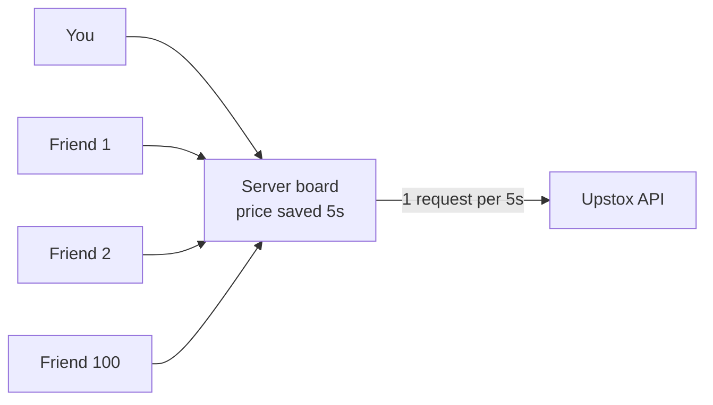
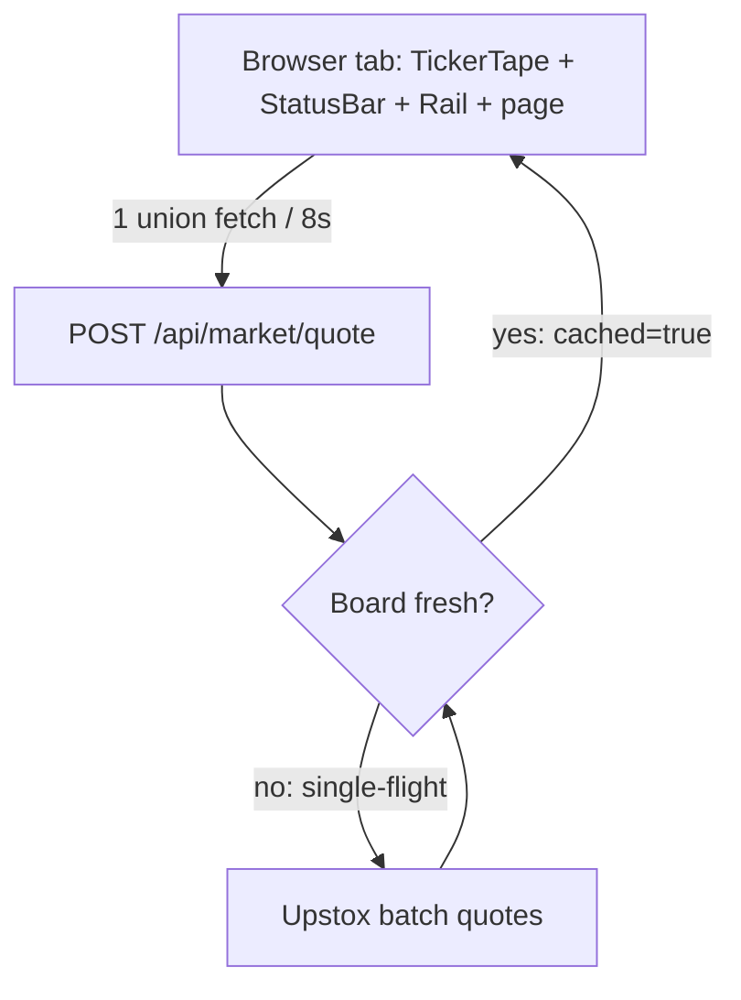

# Market data scaling — the "shared board" design

One-pager for how this project survives 100 concurrent users on one
Upstox token without getting rate-limited.

## Problem in one line

Every page open used to call Upstox again. 100 users x every 5s = ~1200
req/min. Upstox allows ~25 req/s per token. Result: 429s, slow pages.

Same question, same answer: NIFTY price is identical for all users, so
asking Upstox 100 times is waste.

## Solution: shared server board

Ask once per time-window, share with everyone.



1. First request in a window goes to Upstox, result written on board.
2. Next 99 read the board. Zero new Upstox calls.
3. After TTL the board expires, next request refreshes it.

## Where it lives

| Piece                        | File                                  |
| ---------------------------- | ------------------------------------- |
| Board (TTL + single-flight)  | `app/lib/marketCache.ts`              |
| Hot quotes (5s)              | `app/api/market/quote/route.ts`       |
| Full quote (5s)              | `app/api/market/fullquote/route.ts`   |
| Option chain (5s)            | `app/api/market/optionchain/route.ts` |
| Candles (60s, cold)          | `app/api/market/candles/route.ts`     |
| Expiries (12h, coldest)      | `app/api/market/expiries/route.ts`    |
| Health: hits vs Upstox calls | `app/api/market/stats` (GET)          |
| Client: 1 poller per tab     | `app/hooks/useLiveTicks.ts`           |



## TTL table (hot vs cold)

| Data        | TTL | Why                                  |
| ----------- | --- | ------------------------------------ |
| LTP / chain | 5s  | Changes every second in market hours |
| Candles     | 60s | History barely moves intraday        |
| Expiries    | 12h | Changes weekly                       |

## Single-flight (thundering herd guard)

If 100 users miss cache at the same millisecond, only the first triggers
Upstox. The other 99 await the same promise (`inflight` map in
`marketCache.ts`) and all get `cached: true`.

## How to prove it

```powershell
npm run build; npm run start
# open 3 tabs, then:
Invoke-RestMethod http://localhost:3000/api/market/stats
# hits climbs, upstoxCalls stays ~1 per TTL window
```

## Limits + next step

- Current board is in-memory per server instance. Two servers = two boards.
  For multi-instance prod, swap `marketCache.ts` store for Redis.
- Trading wallet/positions/history never touch Upstox; quote failure must
  never block buy/sell.
- True realtime for 100+ live traders = 1 Upstox Market WS v3 socket on the
  server, fan-out to browsers via SSE/WS. That replaces REST polling for LTP.
